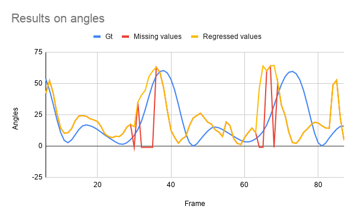

# Missing Keypoint imputation using Random forest regression

## Motivation:
Mobility assessment on elderly using keypoints on video: 
The motivation is to acquire the knee bend estimation and hip bend estimation values same as the expensive wearable sensors but using video analytics using keypoint estimators. It is to prove that video analytics could work same as wearable sensors without having the need for the patient to wear the sensors. 

## Big picture:
* Used 17 point human keypoint detector [EfficientHRNet](https://arxiv.org/abs/2007.08090]) to get the keypoints. (Cannot disclose the code)
* Calculate the knee bend angles and hip bend angle. Compare it to the readings from the wearable sensors .
* Used Random forest regressor to regress the missing keypoints offline.

## Missing Data imputation using Random Forest regressor

CSV with missing keypoints sample is provides [here](https://github.com/malarsaravanan1991/Missing-Keypoint-imputation-withRandom-forest-regression/blob/main/KeypointsFromRevamp.csv). 

EfficientHRnet output missing keypoints as -1.0. The angle calculation is done using 3 point method which requires all the three keypoints to calculate angles. For Example:
* Knee bend (angle) - Calculated between Hip, Knee and Foot keypoint. 
* Hip bend (angle) - Calculated between Shoulder, Hip and Knee Keypoint.
* Angles calculation is done using [Law of cosines](https://stackoverflow.com/questions/1211212/how-to-calculate-an-angle-from-three-points).
Since the keypoints are missing the resulting angles are -1.0 which makes it difficult to compare to the wearable sensors which in turn is considered as gt in our experiment.

#### Missing Keypoints can be filled Offline using Random forest by following the below steps
  * Write the keypoints from the keypoint detector into CSV like [this](https://github.com/malarsaravanan1991/Missing-Keypoint-imputation-withRandom-forest-regression/blob/main/KeypointsFromRevamp.csv) for offline regression.
  * Take only the columns with missing values and find its highly correlated columns For example : If the keypoints are missing in Foot then Foot x,y coordinates is highly correlated to knee than hip or shoulder.
  * Take the X Variable(Ex : Knee_keypoint x,y) and Y Variable (Ex : Foot_keypoint x,y) and seperate it to train and test dataset. The test dataset has the datapoints with -1.0 values. Then perform train,val split on train dataset.
  * Perform Random regression to get multi-ouput and then perform angle calculation on top of it.
  * Script can be found [here](https://github.com/malarsaravanan1991/Missing-Keypoint-imputation-withRandom-forest-regression/blob/main/MultiOuput_RandForestReg.py)

## Pre-Requisite
```
pip install numpy
pip install opencv-python
pip install -U scikit-learn
pip install filterpy
```

## Steps to run
```
python3 MultiOuput_RandForestReg.py --input /path/To/KeypointsFromDetector.csv
                --output /Path/To/RandomForestFinal.csv                
                --gt_file /Path/To/GT.csv
                --image_dir /Path/To/imagesondataset
                --outputimagedir /Path/To/RandomForest_FinalImages
                --X1 Left Knee_x
                --X2 Left Knee_y
                --Y1 Left foot_x
                --Y2 Left foot_y
 ```
 Where 
 * --input - Csv file with Missing keypoint detector
 * --output - Path to Csv file to write the results
 * --gt_file - Optional (if you want to display groundtruth on the images)
 * --image_dir - Optional ( Location of the input image dataset)
 * --outputimagedir - Optional ( Location to store the images with keypoints after regression for visualization)
 * --X1 - Dependent variable column Left Knee_x
 * --X2 - Dependent variable column Left Knee_y
 * --Y1 - Target variable column Left foot_x
 * --Y2 - Target variable column Left foot_y
 
## Results
Below is the results. The red line has missing keypoint hence it has angle values -1.0 which results in the sudden peaks where as the yellow line is the regressed values from Random forest and it is applied with kalman filter on top to have smoothing effect. The other mismatch in the graph are due to the discrepancies in the groudtruth sensor values. 


### Note : 
This code can be improvised but it shows the possiblity that missing keypoint can be imputed using the random forest multi-output regression. Also it can be done with Kalman filter if velocity and time information is provided along with these x,y position coordinates.
